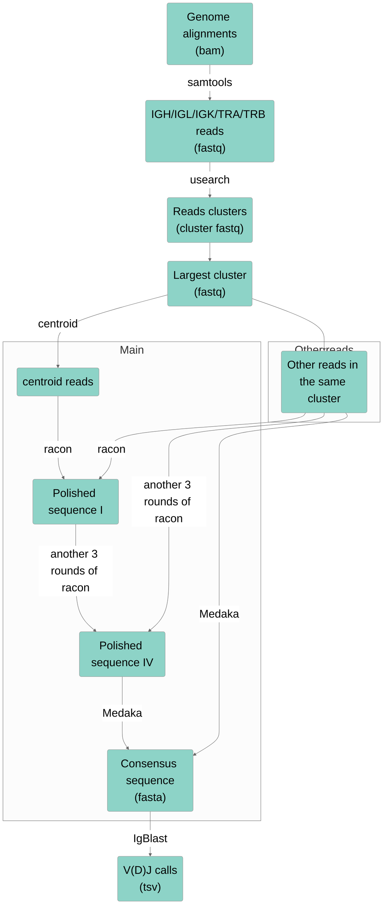

---
# multilingual page pair id, this must pair with translations of this page. (This name must be unique)
lng_pair: post_20221119
title: "Summary of SCAN-seq2 project."

# post specific
# if not specified, .name will be used from _data/owner/[language].yml
author: Zhenyu Liu
# multiple category is not supported
category: Work
# multiple tag entries are possible
tags: [Bioinformatics, Project]
# thumbnail image for post
img: ":post_20221119/cover.jpg"
# disable comments on this page
comments_disable: true

# publish date
date: 2022-11-19 08:11:06 +0900

# seo
# if not specified, date will be used.
#meta_modify_date: 2022-02-10 08:11:06 +0900
# check the meta_common_description in _data/owner/[language].yml
#meta_description: ""

# optional
# if you enabled image_viewer_posts you don't need to enable this. This is only if image_viewer_posts = false
#image_viewer_on: true
# if you enabled image_lazy_loader_posts you don't need to enable this. This is only if image_lazy_loader_posts = false
#image_lazy_loader_on: true
# exclude from on site search
#on_site_search_exclude: true
# exclude from search engines
#search_engine_exclude: true
# to disable this page, simply set published: false or delete this file
#published: false
---

<!-- outline-start -->

We developed SCAN-seq2, a high-throughput, high-sensitivity full-length single-cell RNA-seq method based on TGS platform. The manuscript has been accepted for publication on Cell Discovery. Here I briefly summarized the research progress of this project.

<!-- outline-end -->

---
* TOC
{:toc}

# SCAN-Seq2课题总结

​		SCAN-seq2是承接SCAN-seq而发展的新一代单细胞转录组测序技术。在Tang Lab浩浩荡荡的三代单细胞组学技术革命中，SCAN-seq所代表的转录组测序技术是最早发展、测试与发表的一个。SCAN-seq发表不久，对其进一步改进开发二代技术的课题就开始了紧锣密鼓的准备。雨涵和张雨承担了技术流程优化测试、文库构建等实验工作，而我则负责相关生物信息计算流程的搭建与数据分析。

​   这也是我第一次接触第三代测序技术，从最初的一无所知到逐渐掌握了一些规律与方法，自己在课题过程中也得到了肉眼可见的成长。最终经过两年多的努力，论文最终被***[Cell Discovery](https://www.nature.com/celldisc/)***杂志接收。在这里简单记录一下自己视角中的课题进展历程。

## 课题伊始

### 初次接触ONT

​        我本科阶段主要做基于基于二代测序的组学数据分析，包括ChIP-Seq，ATAC-Seq，RNA-Seq以及单细胞的RNA与ATAC-Seq。在来到汤组之前，我对第三代测序技术的进展与现状几乎毫无了解，说到测序似乎就默认是基于illumina的短读长测序。2020年7月，因为疫情未能返校的我接到了汤老师的电话，汤老师提到当天下午的组会由陆平师姐分享SCAN-seq的数据处理流程，希望我线上参与学习，尽快熟悉三代测序，尤其是ONT的技术特点与分析方法。之后按照陆平师姐组会分享的流程，借用董骥师兄在生物岛实验室经营的服务器，我开始试着处理SCAN-seq产生的ONT原始数据。

8月28日，雨涵找到还未来到实验室报道的我，提到自己在开发高通量的三单转录组测序技术，问我是否愿意合作，并以此作为我大四的本科毕业设计。我受宠若惊，惶然应允，但当时确实很担心自己对新的技术了解不够而耽误课题，便暗下决心之后要好好努力。

{:data-align="center"}

### 第一次测试

由于课题比较紧急，需要在测试数据下机后尽快生成分析结果，我便做了一些前期工作。按照优化后的文库构建流程，我推演了理论的文库结构，并按照理论的文库结构生成了一批模拟数据，用于in silico的计算流程搭建与模拟。第一代的流程较为简单，相较于SCAN-seq唯一的区别在于改进了双端barcode序列的拆分方式，而在其他部分基本未做改动。我在模拟数据上反复确认了流程的可用性，只等第一批数据下机（图为测试使用的部分模拟数据，以及最早的手稿）。

{:data-align="center"}

{:data-align="center"}

2020年10月22 日，第一批测试数据下机，共64颗细胞，使用2个5' barcode与32个3’ barcode进行区分。在视检确认文库结构无误后，对这一批数据进行了已有流程的分析。从上午10点拿到数据释放链接，到晚上11点生成分析报告分享给雨涵，23号上午去和汤老师讨论结果，不得不说这可能是本人工作效率巅峰了哈哈哈哈（尤其是现在下个数据都得好几天）。第一批测试的结果很好，各项质控指标都达到甚至超过了我们的预期，证明了方法流程的可靠性。

之后又进行了几批测试，包括加入UMI的分析，包括更高通量下的表现，基本的计算流程也一点一点完善。课题开始进入稳步推进期。

## 流程搭建

SCAN-seq2带来了新的数据类型，需要新的分析流程。此外，相比于第一代技术的文章，我们还希望进一步拓展全长转录组技术的应用场景，如转录组组装、假基因分析、淋巴细胞表面受体鉴定等等等。这些都是我们实验室之前从未设计的计算领域，对流程的从头搭建提出了进一步要求。

### UMI的处理

SCAN-seq2的流程改进主要体现在三点上：

- 双端barcode组合提高通量
- 优化反转录酶提高覆盖度
- 引入UMI序列提高定量准确性

其中一三两点设计到文库结构的变化，以及响应数据处理流程的调整。双端barcode序列的处理较为简单，直接循环两部拆分即可。然而第三点UMI序列的引入则是我们在流程搭建过程中遇到的一个棘手问题：ONT较高的测序错误率作用于8bp的UMI序列上，给基于UMI的去重算法带来了比较大的挑战。为了解决这个问题，我benchmark了不少类似的流程，具体设计一下几个方面的尝试：

- UMI序列提取：基于长度or基于两侧序列？
- UMI特征输入：sequence only / location only / both ？
- UMI聚类算法：unique / percentile / cluster / adjacency / directional
- UMI容错距离：edit distance 1~3
- ...

多次测试后，我选择了在真实数据上表现最好的参数组合。更进一步，我们通过对同一个文库平行的二代测序与三代测序得到的UMI进行比较，确认了这个流程的可靠性（不过这已经是审稿之后的事情了）。

### 转录组组装

SCAN-seq的发表中提到了鉴定新转录本的问题，当时使用的思路不涉及组装，而是直接`bam2gff`之后利用`pinfish`进行轮次的转录本聚类，并利用`SQANTI`对聚类得到的cluster进行质控，最后再利用`Collapse`进行去重，这一套流程其实是之前的合作方（希望组）根据PacBio Iso-Seq的流程直接修改后套用的，然而ONT的测序错误，尤其是indel几乎必然导致大规模的冗余出现。我认为这一套流程不仅看起来不够简单，而且在ONT数据上表现也不够好。因此我选择的新的方式进行新转录本的鉴定与分析，即基于转录本组装的思路。

决定采用转录本组装之后，一切便都豁然开朗。作为老牌的转录组组装软件，`StringTie2`展示出了较好的表现，尤其是在针对长读长测序技术进行优化之后。与此同时，在转录本组装过程中引入已有的转录本注释可以明显提高组装的准确性，清除测序错误以及soft clip带来的组装误差。这些都是之前基于reads clustering的思路无法实现的。

利用`StringTie2`组装与`SQANTI3`的质控与注释，我们成功对9个细胞系进行了全转录组组装、新转录本的鉴定。同时我们还是用Sanger测序对鉴定到的新转录本进行了验证，验证准确率达到100%，确定了所用流程的可靠性。

### 淋巴细胞表面受体鉴定

TCR与BCR的VDJ重排，以及恒定区的鉴定一直是二代测序难以很好解决的问题，可以很好体现长读长测序的优势。然而我们实验室之前并未做过类似的分析，因此一切从头学起。查了下文章发现，从已有序列中鉴定VDJ重排所使用的元件并不是困难的事情，直接使用IgBlast就可以，那么问题的难度就在于如何从测序序列中提取所需要的TCR/BCR mRNA序列。

首先想到的第一个思路还是转录本组装，然而值得注意的是，常见语境下的转录本组装针对的是基因组的拼接方式而不是序列本身，操作的对象也是gtf文件而非序列文件。在我们的问题中，需要关心的是序列而不是拼接方式，因此这个思路被放弃了。另一个采用的思路是基于序列的基因组组装逻辑，即使用reads overlap的方法组装得到一个assembly，在对这个assembly进行polish与consensus得到高置信度的序列。理论上这应该是最好的思路，但实践过程中发现这些基于序列的组装工具都是为基因组设计的，只适用于较长长度contig的组装。如Flye直接明确不接受3000以下的cotig，且无法调整；而canu虽然可以装短的contig但是效果很差，这一个思路也宣告失败。

最终解决方法来自于一篇Nature Methods上用ONT做amplificon sequencing的文章，他们面临的技术问题与我们类似，而他们的解决方案就很有智慧：先提取目标区域的所有reads，再对reads进行clustering，并选择最大cluster的中心reads作为代表，利用其他reads进行polish与consensus，最终得到了不错的正确率。参考他们的思路，我们成功获取了细胞系中的TCR/BCR序列进行IgBlast，并且结果与已发表文献十分吻合，证实了这一流程的可靠性。

### DTU分析

DTU分析虽然也是SCAN-seq2新加入的内容，但总体较为简单，且不涉及新的流程搭建，只是直接搜索不同的软件包进行调用即可。专门做DTU的软件包不多，且大多没有较好的文档说明。我们最终选择使用DTurtle进行DTU分析，并通过电泳验证了找到DTU事件的可靠性。

## 一波三折

课题早期进展顺利，无论是建库流程测试以及计算流程的优化都有条不紊地推进，似乎我们很快就可以组织好结果准备发表了。然而时候发生了一系列意料之外的波折，很大程度上影响了课题的进度。

### 细胞质量与测序问题

从2021年5月，我们开始准备文稿，汤老师提出10CL文库中质量较差的mES细胞不适合用来发表，建议我们去掉此细胞系，做一次9CL的数据用于发表。原本以为很快，然而新做的9CL细胞系中，GM12878细胞的基因数出现了明显的下降，推测是因为细胞的质量不好造成的，遂再次重做。然而同时养好9个培养条件不同的细胞系并非易时，尤其是AtT20这种细胞小，条件苛刻的细胞系。果然，重做的AtT20出现了类似的问题，如此回环往复了好几次。

除了细胞系质量问题外，2021年下半年的好几个文库都出现了非正常的高交叉污染问题，而且我们没有找到明确的实验流程上的原因，而且这种高交叉污染的问题似乎是随机出现，没有明显的规律。视检reads发现，似乎不同来源的reads出现了串联现象，不同转录本被测在了一条reads中。与此同时，实验室内其他课题的数据也出现了类似的结果。这种现象在2021年底奇怪的消失了，我们至今仍不知道当时发生的原因，究竟是PCR扩增时过量的TSO串联，还是测序公司出现了问题。

### 离谱的审稿人#2

在***Cell Discovery***的第一轮审稿意见返回后，Review #1给出了积极的评价，并对研究内容的进一步丰富与验证提出了一些要求，如更细致的reads信息统计，UMI与二代测序进行比较，对关键生物学发现的补充实验验证等。然而Review #2则对我们的工作给出了严厉的指责，认为我们存在关键结论错误（其实是审稿人自己看错了文章内容），图片说明不清等等问题。更奇怪的是，审稿人#2在审稿意见中要求我们提供非常细节的计算流程说明，包括用法、参数、顺序等等等，并对我们一个关键步骤的实现方法表现出了极大的兴趣，然而这些我们在材料方法中都有描述，甚至已经公开了所有代码。尽管我们认为这些意见是有失公允且无关乎课题的科学内容本身的，我们还是按照两位审稿人的意见做了回应与修改。

第一轮修改之后，经历了一个月的第二轮审稿，我们收到了最终决议：拒稿。在仔细阅读了审稿人的第二轮意见后，我们发现审稿人#1的意见非常积极，觉得可以直接接收，拒稿的决定主要是因为审稿人#2的强烈反对。然而离谱的是，审稿人#2的意见存在着明显的问题与事实性错误。7条意见中有4条在说我们没有正确引用图片，如：

> c) Paragraph starting on line 81 makes a wrong citation of Supplementary Figure S3. It should be S7.
>
> e) Citation of Supplementary Figure S4 in line 93 appears to be wrong and the same for Supplementary figure S5 in the paragraph starting in line 102. I believe this is S10.

然而我们仔细确认后确信，所有图片的引用都是正确的，似乎是审稿人拿着我们修改前的文稿和修改后的图，然后告诉我们：“你们的图和你们的文字对不上哦”。

这还不是最离谱的，审稿人的一条意见认为我们计算得到的非经典剪切位点比例过高：

> f)  2% non-canonical junctions are probably too many. In the human reference, they are 0.05%.

我们一开始还信以为真，觉得是我们的计算出现了问题。然而在查找了文献后，我们发现多篇文章对这一数字有了明确的报导值：1.3~1.4%，与我们文章中计算得到less than 2%吻合。我们至今仍不知道审稿人认为的0.05%是从何而来，但确实对这种不错调研拿着异想天开的数据指责别人的行为大跌眼镜。

一般来说，拒稿的决定一旦做出，代表着审稿流程的终止，不再有争取的机会。然而在这种情况下，审稿人#2的意见明显是不客观、不合理且不负责任的，在汤老师的支持下，我们仔细举证了审稿人#2意见中的种种事实性错误，清楚展示之后寄给了编辑。编辑对我们提供的证据表示认可，并允许我们重新提交稿件，否定掉审稿人#2的审稿意见，交由其他审稿人进行重新评议。最终，在22年11月18日，我们收到了文章接收的决议。

我们不知道审稿人#2的身份，也不知道他为什么会拿错论文的手稿，捏造数据来对我们进行指责，更不知道他为什么在第一轮审稿时仔细盘问无关科学发现本身的代码细节，可能是遇见了做类似课题存在利益冲突的同行吧。但好在我们合理而有分寸地维护了自己的权利，编辑也认识到了审稿人意见的偏颇并做出了改变，最终happy ending。

  
振宇

  
于实验设备二号楼

  
2022年11月19日夜

